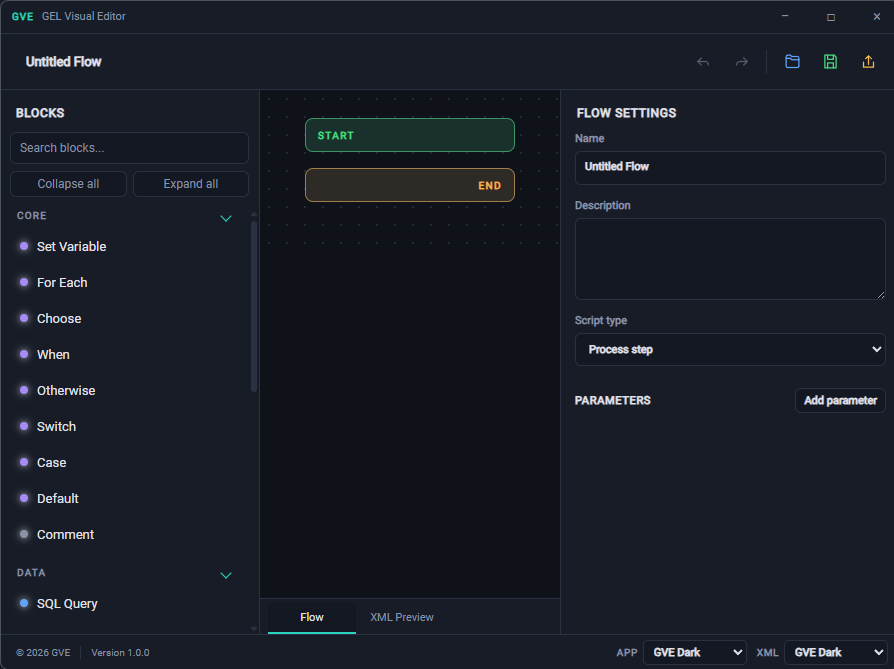
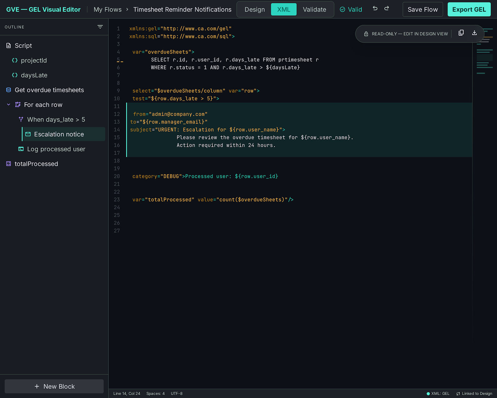
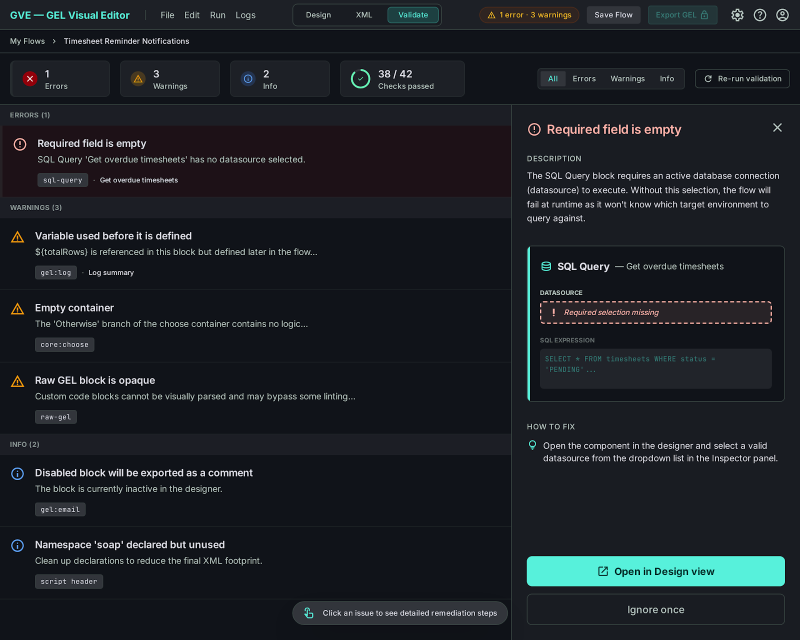
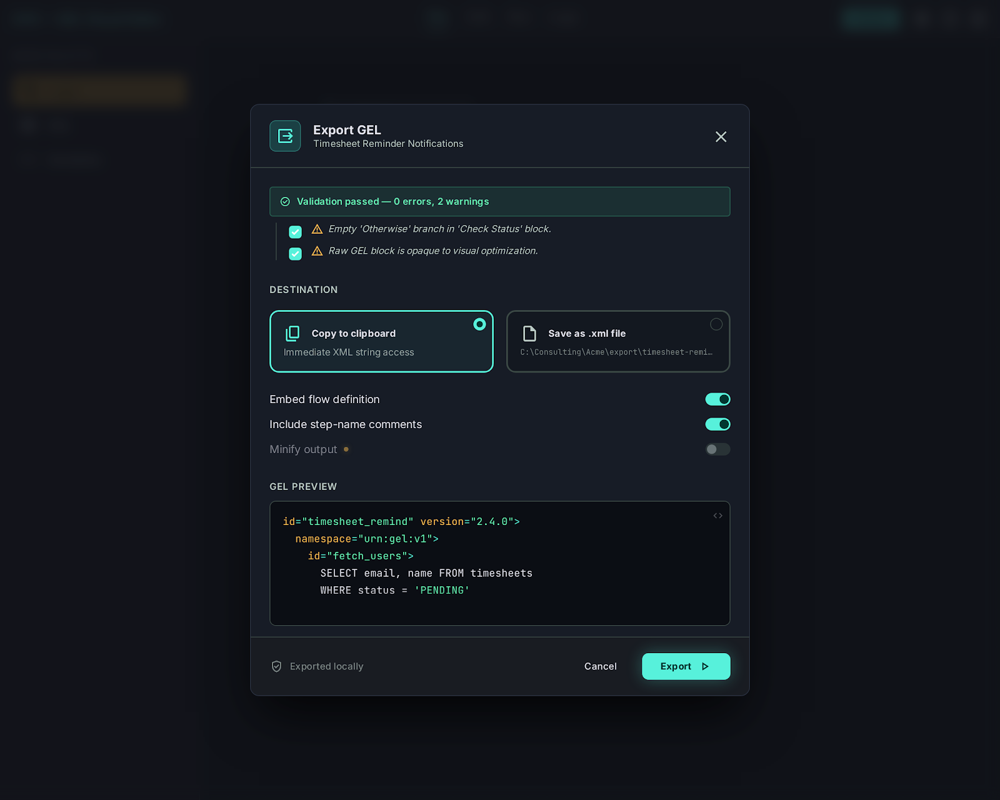
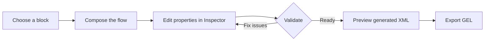

<div align="center">
  

# GVE — GEL Visual Editor

**Build Clarity PPM GEL workflows visually.**

Compose nested logic with blocks, inspect the generated XML, validate before export, and keep the whole workflow local to your machine.

  <p>
    <a href="https://github.com/DZisopoulos/gel-visual-editor/releases/tag/alpha-0.1"></a>
    <a href="https://github.com/DZisopoulos/gel-visual-editor/releases/tag/alpha-0.1"></a>
    
    
    
    <a href="LICENSE.md"></a>
  </p>
</div>

> GVE is an offline-first desktop editor for designing, reviewing, and exporting GEL scripts. It is free for personal, educational, and other non-commercial use. Commercial use requires written permission.

> **Versioning:** the current application/package version is `1.0.0`; the published distribution channel is the `Alpha 0.1` release (`alpha-0.1`).

## At a glance

|                           | What you get                                                                                                                             |
| ------------------------- | ---------------------------------------------------------------------------------------------------------------------------------------- |
| **Visual authoring**      | Drag, nest, reorder, duplicate, disable, and remove workflow blocks without hand-writing XML.                                            |
| **Round-trip safe files** | Save editable `.gve` flow documents and export GEL XML with an embedded flow definition and body hash.                                   |
| **Built-in quality gate** | Validate required fields, variable scope, empty containers, disabled blocks, duplicate variables, and unknown block types before export. |
| **IDE-style workspace**   | Palette, dotted flow canvas, inspector, outline panel, command palette, undo/redo, zoom, focus mode, and keyboard navigation.            |
| **Themeable code view**   | Choose independent app and XML themes, including GVE Aurora, GVE Dark, Dracula, GitHub Light, GitHub Dark, Material, and Nord.           |
| **Portable delivery**     | Download the Windows portable executable and run it from any folder — no installer required.                                             |

## Screenshots

### Flow editor

The main workspace combines the block palette, flow canvas, and inspector. The canvas is intentionally calm and dense: nested logic stays readable while the inspector keeps the selected block's details close at hand.



### XML preview and validation

The workspace tabs switch the center panel between **Flow**, **XML Preview**, and **Validate**. XML Preview is read-only and powered by Monaco with XML folding, syntax highlighting, completion hints, smooth scrolling, and a copy action.

The repository also includes visual direction captures for the XML, validation, welcome, and export experiences in [`docs/design/stitch/`](docs/design/stitch/). Those images are design references; the runtime UI and feature behavior are defined by the source under `src/`.

<details>
<summary>Open the design reference captures</summary>

| XML preview                                                                             | Validation                                                                      | Export dialog                                                               |
| --------------------------------------------------------------------------------------- | ------------------------------------------------------------------------------- | --------------------------------------------------------------------------- |
|  |  |  |

</details>

## Why GVE?

GEL scripts are powerful, but hand-authoring nested XML makes small changes expensive and easy to get wrong. GVE gives each step a structured editor while preserving the generated script as a first-class artifact:



The editable flow and exported XML are linked by a versioned `GVE-FLOW` marker. When an exported file is opened again, GVE can detect whether the XML body drifted from the embedded flow definition and warn you instead of silently losing structure.

## Feature tour

### Visual flow canvas

- Drag blocks from the palette into the root flow or any container.
- Drag existing blocks to reorder or move them into nested containers.
- Double-click a palette item to add it to the end of the flow.
- Select a block to edit its properties in the inspector.
- Duplicate, disable/enable, save as a reusable snippet, or delete any block.
- Start and end caps make the execution path immediately visible.
- Zoom from 70% to 140% with the canvas controls or `Ctrl/Cmd` shortcuts.
- Toggle the outline panel to jump around large flows.

### Block palette

The palette is searchable, scrollable, keyboard accessible, and organized into collapsible categories. It currently includes 23 block types:

| Category        | Blocks                                                                          |
| --------------- | ------------------------------------------------------------------------------- |
| **Core**        | Set Variable, For Each, Choose, When, Otherwise, Switch, Case, Default, Comment |
| **Data**        | SQL Query                                                                       |
| **Integration** | HTTP Call, SOAP Invoke, FTP Transfer, File Read, File Write                     |
| **Clarity**     | Send Email, Log Message, XOG Read, XOG Write                                    |
| **Advanced**    | Try, Catch, Include Script, Raw GEL                                             |

### Inspector and variables

The inspector renders the registered fields for the selected block, including SQL query options, text scaling choices, expressions, nested content, and enabled state. It also shows variables currently in scope, which makes it easier to build expressions without guessing what is available at each step.

### Validation before export

Validation runs against the same registry that generates GEL. It reports:

- Missing required values.
- Variables referenced before they are introduced or outside their scope.
- Empty container blocks.
- Duplicate variable introductions.
- Unknown or unsupported block types.
- Disabled blocks that will be emitted as comments.

Export is blocked for errors and asks for confirmation when warnings remain.

### Templates and snippets

Start from a ready-made flow instead of a blank canvas:

- **Query → loop → log**
- **Error handling**
- **HTTP notification**

Save frequently used blocks to the local snippet library and insert them into another flow later. Snippets and theme preferences are stored locally in the browser profile used by the desktop app.

### Themes

The app theme and XML editor theme can be changed independently and persist between sessions:

- GVE Aurora
- GVE Dark
- Dracula
- GitHub Light
- GitHub Dark
- Material
- Nord

### Command-driven workflow

Press `Ctrl/Cmd + K` to search commands and add any registered block without leaving the keyboard. Focus mode hides the side panels for a canvas-first view, while the menu bar exposes file, edit, view, help, and layout commands.

## Installation

### Windows portable release (recommended)

1. Download [`gve-alpha-0.1-portable.exe`](https://github.com/DZisopoulos/gel-visual-editor/releases/download/alpha-0.1/gve-alpha-0.1-portable.exe) from the [Alpha 0.1 release](https://github.com/DZisopoulos/gel-visual-editor/releases/tag/alpha-0.1).
2. Place the executable in a folder you control.
3. Run it directly. There is no installer and no setup wizard.

The release is an early alpha. Windows SmartScreen may show a warning for an unsigned binary; verify that the file came from the official repository release page before continuing.

Optional SHA-256 verification in PowerShell:

```powershell
Get-FileHash .\gve-alpha-0.1-portable.exe -Algorithm SHA256
```

### Run from source

Requirements: a current LTS version of [Node.js](https://nodejs.org/) and npm.

```bash
git clone https://github.com/DZisopoulos/gel-visual-editor.git
cd gel-visual-editor
npm install
npm run dev
```

To build the application:

```bash
# Type-check and create production bundles
npm run build

# Windows installer / distributable build
npm run build:win

# Unpacked portable-style build for local testing
npm run build:unpack
```

The unpacked Windows executable is written to `dist/win-unpacked/gve.exe`.

## Working with flow files

### Editable `.gve` documents

`.gve` files are versioned JSON documents containing the flow metadata, parameters, block tree, and block properties. They are the source-of-truth format for editing.

### Exported `.xml` documents

Export creates a GEL script with:

- Only the namespaces needed by the flow.
- Step-name comments for readable generated output.
- Disabled blocks preserved as comments.
- An embedded, versioned GVE flow definition.
- A body hash used to detect later XML drift.

GVE can reopen its own exported XML and restore the embedded flow definition. XML without the GVE marker is rejected intentionally so an unrelated script cannot be mistaken for an editable GVE document.

## Keyboard shortcuts

| Shortcut                                 | Action                                     |
| ---------------------------------------- | ------------------------------------------ |
| `Ctrl/Cmd + K`                           | Open command palette                       |
| `Ctrl/Cmd + Z`                           | Undo                                       |
| `Ctrl/Cmd + Shift + Z` or `Ctrl/Cmd + Y` | Redo                                       |
| `Ctrl/Cmd + Shift + F`                   | Toggle focus mode                          |
| `Ctrl/Cmd + +` / `Ctrl/Cmd + -`          | Zoom canvas in/out                         |
| `Ctrl/Cmd + 0`                           | Reset canvas zoom                          |
| `Delete` / `Backspace`                   | Remove the selected block                  |
| `Escape`                                 | Close the active dialog or command palette |

## Project structure

```text
src/
├─ main/                         Electron main process and atomic file I/O
├─ preload/                      Typed renderer bridge
├─ renderer/src/
│  ├─ components/                Canvas, palette, inspector, XML, dialogs, menus
│  ├─ store.ts                    Undoable flow state and tree operations
│  ├─ theme.ts                    App/XML themes and Monaco theme definitions
│  └─ theme.css                   Themed desktop UI styling and animations
└─ shared/
   ├─ registry/                   Block definitions, fields, namespaces, GEL emitters
   ├─ generate.ts                 GEL generation
   ├─ roundtrip.ts                XML marker and drift-safe import/export
   ├─ schema.ts                   Runtime document validation
   └─ validate.ts                 Flow quality checks and scope analysis
tests/                            Renderer, store, schema, XML, registry, and validation tests
docs/                             Design references and implementation plans
resources/                        Application icon and packaging assets
```

## Development commands

```bash
npm run dev            # Start Electron with Vite HMR
npm test -- --run      # Run the complete Vitest suite
npm run typecheck      # Check Node and renderer TypeScript projects
npm run lint           # Run ESLint
npm run format         # Format the repository with Prettier
npm run build          # Type-check and build Electron bundles
```

Before opening a pull request, run at least:

```bash
npm test -- --run
npm run typecheck
npm run build
```

## Architecture notes

GVE uses a small, explicit data model rather than a visual-only graph. Each block is registered with its display metadata, editable fields, namespaces, variable-introduction rules, and GEL renderer. The renderer and the shared export/validation layers therefore agree on the same vocabulary.

- **React + TypeScript** power the renderer and typed UI state.
- **Zustand** stores the flow, selection, history, and tree mutations.
- **Electron** provides the desktop shell and native open/save dialogs.
- **Monaco Editor** renders the read-only XML preview and completion hints.
- **Vitest + Testing Library** cover shared serialization, validation, registry behavior, store operations, and renderer interactions.

No account, server, or cloud workspace is required. Files are written through native local dialogs, with atomic replacement to reduce the chance of a partial save.

## Contributing

Issues and pull requests are welcome for bug fixes, accessibility improvements, new block definitions, tests, and documentation. For a new block, include its registry definition, GEL renderer, inspector fields, validation behavior, and tests that cover round-trip generation where applicable.

Please keep changes focused and run the verification commands above before submitting a pull request.

## License

GVE is released under the [GVE Personal Use License](LICENSE.md).

You may use it free of charge for personal, educational, and other non-commercial purposes. Commercial use, redistribution, resale, sublicensing, incorporation into a paid product or service, or any other use intended to generate revenue requires prior written permission from Dimitrios Zisopoulos.

Copyright © 2026 Dimitrios Zisopoulos. All rights reserved.

## Links

- [Download Alpha 0.1](https://github.com/DZisopoulos/gel-visual-editor/releases/tag/alpha-0.1)
- [Repository](https://github.com/DZisopoulos/gel-visual-editor)
- [Issue tracker](https://github.com/DZisopoulos/gel-visual-editor/issues)
- [License](LICENSE.md)
